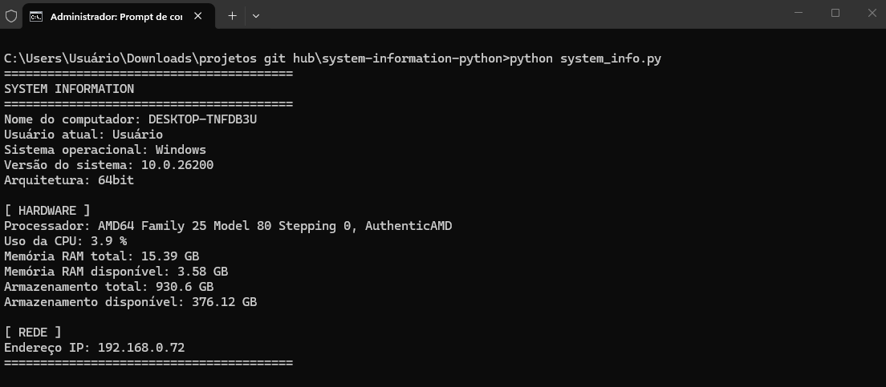

# System Information Python

Projeto desenvolvido em Python para coleta e exibição de informações básicas do sistema, hardware e rede de um computador.

O projeto foi desenvolvido como prática de programação em Python, com aplicação de conceitos relacionados à área de Suporte Técnico e infraestrutura.

## 🛠️ Tecnologias utilizadas

* Python 3
* Biblioteca `platform`
* Biblioteca `getpass`
* Biblioteca `socket`
* Biblioteca `psutil`

## ⚙️ Funcionalidades

O programa coleta e exibe informações sobre:

### 💻 Sistema

* Nome do computador
* Usuário atual
* Sistema operacional
* Versão do sistema
* Arquitetura do sistema

### 🖥️ Hardware

* Processador
* Uso atual da CPU
* Memória RAM total
* Memória RAM disponível
* Armazenamento total
* Armazenamento disponível

### 🌐 Rede

* Endereço IP local do computador

## ▶️ Como executar

### 1. Clone o repositório

```bash
git clone https://github.com/mxtheusz7/system-information-python.git
```

### 2. Acesse a pasta do projeto

```bash
cd system-information-python
```

### 3. Instale a biblioteca necessária

```bash
pip install psutil
```

### 4. Execute o programa

```bash
python system_info.py
```

## 🖼️ Exemplo de execução



## 📚 Objetivo

Este projeto foi desenvolvido para praticar conceitos de Python e explorar sua aplicação na coleta de informações de sistemas, hardware e rede.

A ferramenta pode servir como apoio em atividades de diagnóstico e suporte técnico, permitindo consultar de forma rápida informações básicas do computador.

## 👨‍💻 Autor

**Matheus Oliveira**

GitHub: [@mxtheusz7](https://github.com/mxtheusz7)
